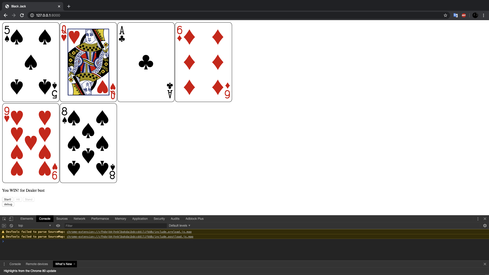
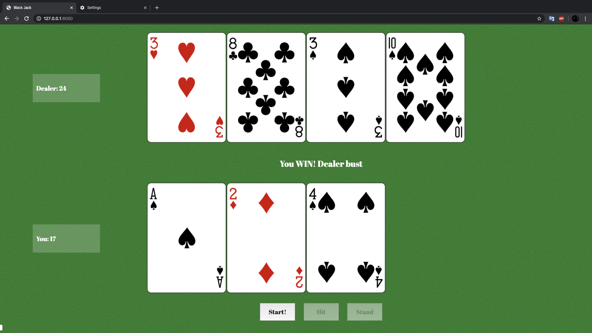

# Black Jack
This project is a simple web based Black Jack game, built with [Deck of Cards](http://deckofcardsapi.com). Click [here](https://jonysand-blackjack.glitch.me) to play!

## About
This is a simple black jack game. Simple press "Start" to start or reset the game. Try to win the Dealer!

## Built with

* [VS Code](https://code.visualstudio.com/)
* [Github](https://github.com)
* [Deck of Card](http://deckofcardsapi.com)

## Notes & Process
I started with making it functional first, with the step of fetching data, organizing data and designing interaction. The inital prototype looks like following.

 
> Prototype

After making sure that the game is functioning well, I organized the distribution of each element to make it look more inviting. Besides I used the texture from [TRANSPARENT TEXTURES](https://www.transparenttextures.com) as the background. And here's the final version.

 
> Final version

## Challenges & Struggles
The main struggle is about `async function`. When this kind of function is called, the browser will start a thread in the background while not blocking excuting following code. Although this may make program faster, but making it a bit harder to tracking variables. As in my case, I need to record the total point of both player and dealer, with some `if statement` to decide whether the game ends and who wins. The `async` makes things unsure about if a certain code has been excuted.

Here's how I solve this. For debugging part, since normally `console.log` can not print out the result as expected, I added a button to show variables I'm interested, which garantees that `console.log` is excuted after every changes has been made. Besides, instead of calling `async function` continuously, which may cause mess in the order of data, I let them call themself if necessay at the end of the function. Also some `state` variables keep the whole multi-thread process in control.

## References

* [Deck of Cards](http://deckofcardsapi.com)
* [TRANSPARENT TEXTURES](https://www.transparenttextures.com)
